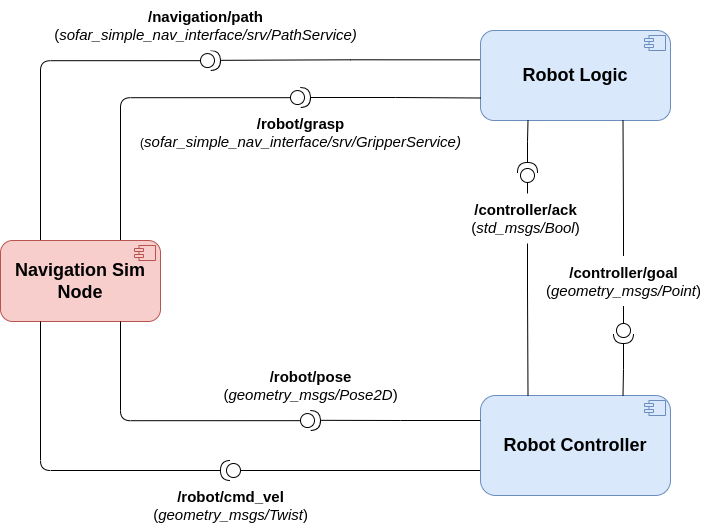

# sofar-nav-simulator
Final exam for the SOFAR 2023 course - JEMARO Session. The goal is to implement a simple navigation simulation for a mobile robot in a known environment, exploiting A* algorithm. Implementation is done via ROS2/Python with the help of the Arcade library.

## Dependencies

The project targets ROS2 distributions. It has been successfully tested with Galactic and Humble distros (desktop installation).

The only external depencency needed is Arcade library (see [Instructions for Linux install](https://api.arcade.academy/en/latest/install/linux.html))

## Execution

Clone the repository in your workspace and compile as usual.

Run the simulation node with the command:

```ros2 run sofar_simple_nav nav_sim```

## Assignment


According to which portion of the exam you need to take, you can focus on specific parts of the assignment:
- If you're taking the full exam, read further, as you will need to implement the full architecture, made up of three nodes.
- If you're taking the pub/sub part only (Part #2), focus on point 2) for the development of the controller.
- If you're taking the client/service part only (Part #3), focus on part 3) for the implementation of the robot logic + you will need to implement the two service interfaces (only the .srv file, the callbacks are already implemented inside *sim_node.py*). To this extent, make sure to analyze the commented code in *sim_node.py* to correctly define the service interfaces. Of course, feel free to de-comment the code once you have provided the interfaces to test your solution.


1) The **navigation sim node** is already provided with this repository and acts as the simulator of the mobile robot navigating in a known environment, exposing all the necessary interfaces. Specifically, the robot is tasked with bringing the crate to the goal position. To do that, the robot needs to navigate to the crate, grasp it and then bring it to the goal position (represented by a green flag). The map is randomly generated every time you launch the simulation, with an assured path between robot and its goals.
    1. *Subscribed Topic*
       1) **/robot/cmd_vel**: twist message to control linear and angular velocities of the mobile robot
    2. *Published Topic*
       1) **/robot/pose**: 2D pose of the robot, that is x, y and theta. Useful for control purposes
    3. *Exposed Services*
       1) **/navigation/path**: allows retrieving the optimal path (which is already computed, you do not need to worry about implementing the planner) from starting robot's pose to crate and then from crate to goal. To distinguish between the two, the service takes an integer index as part of its request. Specifically, set the index to 0 to retrieve the path from robot's starting pose to crate, whereas set it to 1 to retrieve the path from crate to goal.
       2) **/robot/grasp**: allows the robot to grasp the crate, provided it is in the vicinity of it. Otherwise, calling the service will have no effect...

2) The **controller node**, which controls the robot to drive it through the path's waypoints and to the goals. Controller receives target waypoints one by one on the **/controller/goal** topic, outputs *cmd_vel* messages based on the control law and returns an acknowledgment whenever a waypoint is reached. Beware that, in this scenario, you need to control linear and angular motion independently to replicate the behavior you see in the GIF below.

3) The **robot logic node**, which acts as *high-level controller*, invoking the **/navigation/path** service to retrieve the list of waypoints, according to the path index (either to reach the crate or the final goal). The node publishes a new target waypoint on **/controller/goal** whenerer the controller signals its idle state. As soon as the robot reaches the crate, the robot logic node tries to grasp it and, if successfull, proceeds in the navigation to reach the green flag. Since we're implementing a simplified version (without actions servers), you may need to add the following piece of code at the beginning of you logic node, to ensure that the node can properly *spin*:

```
logic = RobotLogic()
    
# Spinning thread to make sure callbacks are executed
spin_thread = Thread(target=rclpy.spin, args=(logic,))
spin_thread.start()
```



### Important Notes

**BEWARE: it is mandatory to rename your package before submission on AulaWeb (make sure to change the package name in the *setup.py*, *package.xml*, under the *resource* folder, in the *setup.cfg* and inside *sim_node.py* at line 32) according to the following template &rarr;** *&lt;surname&gt;_&lt;matricola&gt;_final* 

**BEWARE2: It is mandatory to launch the full simulation using a launch file. SUBMISSIONS NOT INCLUDING A LAUNCH FILE WILL NOT BE EVALUATED!!!**

Good luck ;)

## Expected Output


